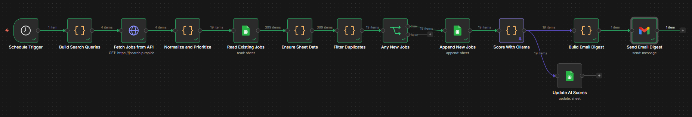

# Job Tracker - n8n Automation

Automated job scraping and tracking system that finds entry-level tech jobs across British Columbia, filters out bad listings, saves everything to Google Sheets, and emails me a daily digest.

Built with n8n (self-hosted via Docker on Windows 11).

## Table of Contents

- [What It Does](#what-it-does)
- [Keyword Rotation](#keyword-rotation)
- [Priority Tiers](#priority-tiers)
- [Location Mismatch Detection](#location-mismatch-detection)
- [Google Sheet Structure](#google-sheet-structure)
- [Workflow Nodes](#workflow-nodes)
- [Screenshots](#screenshots)
- [Tech Stack](#tech-stack)
- [Setup From Scratch](#setup-from-scratch)
- [What's Next](#whats-next)
- [Known Issues](#known-issues)

## What It Does

Every day at 7 AM, this workflow:

1. Picks a batch of job search keywords from a rotating list of 50 titles across 5 priority tiers
2. Hits the RapidAPI JSearch API for each keyword (with rate limiting to stay on the free tier)
3. Filters results to British Columbia only
4. Checks job descriptions for location mismatches (e.g., listing says BC but job is actually in Toronto or Montreal)
5. Tags remote-friendly positions
6. Compares new jobs against existing entries in Google Sheets to avoid duplicates
7. Appends new jobs to the spreadsheet with priority level, tier, and notes
8. Scores each new job 1-10 for relevance using a local Ollama AI model (Mistral 7B)
9. Sends an email digest with jobs split into High Priority and Low Priority tables, sorted by AI score with scores displayed

## Keyword Rotation

50 job titles are grouped into 12 search query batches. Each day, the workflow runs a different subset to stay within the free API limit (~200 requests/month).

| Day | What Runs |
|-----|-----------|
| Day 0 | Tier 1 + Tier 2 (IT support, help desk, data entry, admin, junior dev, analysts) |
| Day 1 | Tier 3 + Tier 4 start (frontend/backend dev, DBA, sysadmin, network admin) |
| Day 2 | Tier 4 end + Tier 5 (QA, security, GRC, audit, consulting) |
| Day 3 | High priority refresh (re-runs Tier 1 and 2 core groups) |

Then repeats.

## Priority Tiers

| Tier | Priority | Examples |
|------|----------|---------|
| 1 | High | IT Support Specialist, Help Desk Technician, Data Entry, Admin Coordinator |
| 2 | High | Junior Web Developer, Data Analyst, Business Analyst, CRM Coordinator |
| 3 | High | Frontend/Backend/Full Stack Developer, DBA, Research Analyst |
| 4 | Low | IT Administrator, Systems Admin, QA Analyst, Cybersecurity Coordinator |
| 5 | Low | GRC Analyst, IT Auditor, ERP Consultant, Penetration Tester |

Jobs can also be downgraded to Low Priority if a location mismatch is detected in the description.

## Location Mismatch Detection

The workflow scans job descriptions for mentions of Toronto, Montreal, Quebec, Ontario, Calgary, Edmonton, Winnipeg, Saskatoon, Regina, Halifax, and Ottawa. If any of those appear and the description does NOT mention remote/work from home/anywhere in Canada, the job gets:

- Priority dropped to Low
- A flag in the Notes column like "LOCATION MISMATCH: Description mentions Toronto, ON but listing says BC"

Remote jobs that mention other cities are left alone and tagged "REMOTE OK" instead.

## Google Sheet Structure

| Column | Description |
|--------|-------------|
| Title | Job title |
| Company | Employer name |
| Location | City, Province |
| URL | Link to the job posting |
| Source | Where the listing came from (Indeed, LinkedIn, Glassdoor, etc.) |
| Date Posted | When the job was posted |
| Salary | Salary range if available, otherwise "Not listed" |
| Description Snippet | First 300 characters of the job description |
| Date Scraped | When the workflow found this job |
| Status | New, Applied, Interview, Rejected, or Offer |
| Priority | High or Low |
| Tier | 1 through 5 |
| AI Score | Relevance score 1-10 from Mistral 7B via Ollama. 9-10 = perfect match, 7-8 = strong match, 5-6 = possible fit, 3-4 = weak match, 1-2 = not relevant. |
| Notes | Mismatch flags, remote tags, search group |
| Resume Version | Track which resume version was used to apply |

## Workflow Nodes

```
Schedule Trigger (daily 7 AM PST)
        ↓
Build Search Queries (keyword rotation, tier/priority assignment)
        ↓
Fetch Jobs from API (HTTP Request, batch size 1, 2s delay)
        ↓
Normalize and Prioritize (parse fields, filter to BC, detect mismatches)
        ↓
Read Existing Jobs (Google Sheets, pull all URLs)
        ↓
Ensure Sheet Data (handles empty sheet edge case)
        ↓
Filter Duplicates (compare new URLs against existing)
        ↓
Any New Jobs? (IF node)
        ↓
Append New Jobs (Google Sheets)
        ↓
Score with Ollama (Mistral 7B, rates each job 1-10 via local API)
        ↓                              ↓
Update AI Scores            Build Email Digest
(Google Sheets,             (HTML email with scores,
writes scores back)          sorted by relevance)
                                       ↓
                            Send Email Digest (Gmail)
```

## Screenshots

Workflow and application screenshots to visualize the automation process.



## Tech Stack

- **n8n** 2.19.5, self-hosted via Docker Desktop on Windows 11 (WSL 2)
- **Google Sheets** for job storage and status tracking
- **RapidAPI JSearch** for job scraping (free tier, 200 requests/month)
- **Gmail** for daily email digest
- **Ollama** Mistral 7B running locally for AI-based job relevance scoring (1-10 per listing)

## Setup From Scratch

### Prerequisites
- Windows 11 with WSL 2 and Docker Desktop
- Google account
- RapidAPI account (free)
- Ollama installed (ollama.com)

### Steps
1. Run n8n via Docker: `docker run -it --rm --name n8n -p 5678:5678 -v n8n_data:/home/node/.n8n n8nio/n8n`
2. Create a Google Cloud project, enable Sheets API, Drive API, and Gmail API
3. Set up OAuth consent screen, add yourself as a test user
4. Create OAuth2 web client with redirect URI `http://localhost:5678/rest/oauth2-credential/callback`
5. In n8n, create Google Sheets OAuth2 and Gmail OAuth2 credentials using the client ID and secret
6. Subscribe to JSearch API on RapidAPI (free tier)
7. Import the workflow JSON from the `workflows/` folder
8. Update the RapidAPI key in the Fetch Jobs from API node
9. Update the email address in the Send Email Digest node
10. Activate the workflow
11. Install Ollama from ollama.com
12. Pull the Mistral model: `ollama pull mistral`
13. Verify Ollama is running: `curl http://localhost:11434/api/version`
14. Verify Docker can reach Ollama: `docker exec -it n8n wget -qO- http://host.docker.internal:11434/api/version`

## What's Next

- [ ] Add Slack notifications as an alternative to email
- [ ] Dashboard view of application status breakdown
- [ ] Switch to llama3.2:3b for faster scoring (currently ~15 seconds per job with Mistral)
- [ ] Add confidence threshold to auto-hide jobs scoring below 3
- [ ] Weekly summary email with application status breakdown

## Known Issues

- Triple Eight Transport (Abbotsford) gets flagged as a location mismatch because the company description mentions Calgary and Edmonton terminals, even though the job itself is in BC. False positive; AI scoring will fix this.
- Some senior-level jobs (e.g., "Senior SW Bluetooth Engineer") show up as High Priority because they come from keyword groups that match broader queries. AI scoring will downgrade these.
- "Various Employers" appears as company name for some aggregator sites like JobEase. These are real listings but the company name isn't specific.
- Ollama must be running on the host machine when the workflow triggers. If the computer restarts, verify Ollama is active at localhost:11434.
- Scoring takes approximately 15 seconds per job with Mistral 7B. A batch of 25 jobs takes about 6-7 minutes.
- The Ensure Sheet Data node exists because n8n's Google Sheets Read node stops the flow when the sheet has no data rows. A dummy row with URL "https://placeholder.example.com/dummy" must remain in the sheet.
- `fetch()` is not available in n8n Code nodes. All HTTP requests from Code nodes must use `this.helpers.httpRequest()` instead.